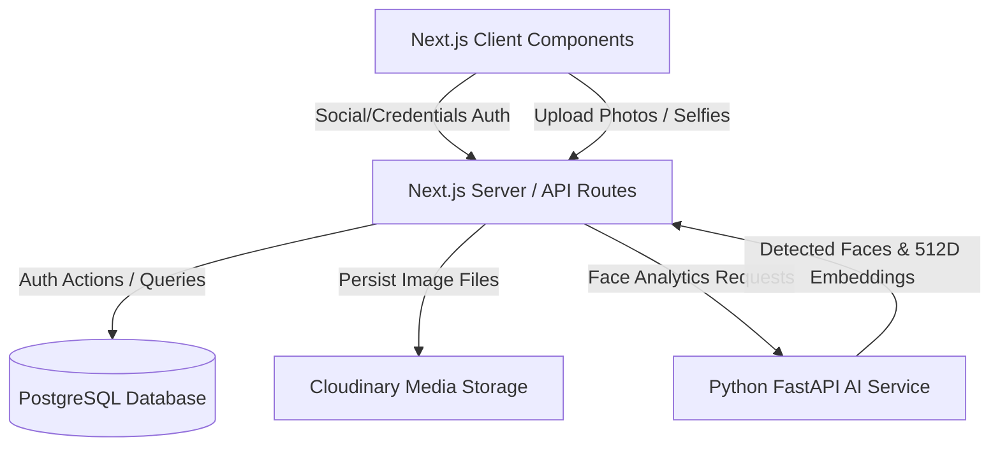

# System Architecture

The AI Event Photo Share application uses a multi-tier service-oriented architecture with Next.js serving as the core application engine.

## Core Architectural Components

### 1. Unified Authentication Layer
The system uses `@neondatabase/auth` for user verification.
- Client requests go through a custom local proxy API endpoint (`/api/auth/[...path]`).
- Next.js 16 Edge-based `proxy.ts` automatically intercept requests to protected routes (`/dashboard`, `/profile`, `/settings`), checking sessions and redirecting unauthenticated traffic to `/auth/sign-in`.

### 2. Media Upload & Processing Flow
- Multi-file image uploads are handled on the client using `react-dropzone` and compressed locally using `browser-image-compression`.
- Compressed images are posted to server API endpoints which forward them to Cloudinary.
- Successfully stored Cloudinary URLs are registered in the PostgreSQL `photos` table with status `PENDING`.
- Photo IDs are dispatched to an in-memory sequential `ProcessingQueue`.

### 3. Background AI Pipeline
- The queue executes tasks sequentially using `EmbeddingService`.
- For each photo, it calls the Hugging Face hosted FastAPI Python AI service `/analyze` endpoint.
- Python detects all faces using the `buffalo_l` InsightFace model and extracts a 512-dimension double precision float array for each face.
- Next.js inserts the bounding box coordinates, quality metadata, and face embeddings into the `photo_faces` table, updating the photo processing status to `COMPLETED`.

### 4. Vector Search & Similarity Matching
- When a user uploads a selfie to an event, the system extracts the user's facial embedding via the FastAPI `/embedding` endpoint.
- The user's selfie embedding is saved to the `selfies` table.
- The system executes a cosine similarity search comparing the selfie embedding to all detected `photo_faces` embeddings in the event.
- If the `vector` extension is active in Postgres, the similarity is computed natively using `(1 - (pf.embedding <=> $2::vector(512)))`.
- If the `vector` extension is missing, a JS fallback automatically fetches all face embeddings and computes cosine similarity using custom JavaScript array math, filtering matches by similarity threshold.
